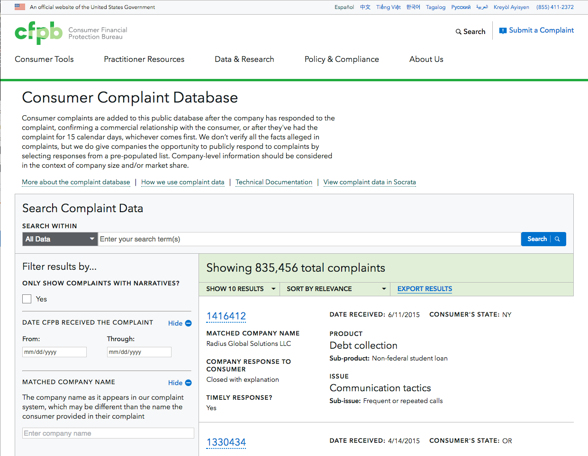

# Consumer Complaint Database - 5.0

[](https://travis-ci.org/cfpb/ccdb5-ui)
[](https://coveralls.io/github/cfpb/ccdb5-ui?branch=master)

**Description**:
This application allows consumers to search complaints submitted to the CFPB by other consumers.

#### Technology Stack
This application is written in JavaScript and [Less](http://lesscss.org) within
the [React](https://facebook.github.io/react/) + [Redux](http://redux.js.org/) 
framework.  It uses [Webpack](http://webpack.github.io/docs/) at runtime to 
manage module loading.

The code is written with the [ES6](http://es6-features.org/) feature set
of JavaScript. Backwards compatibility is achieved by compiling the script with
[Babel](https://babeljs.io/) prior to using it within the browser.

Unit testing of the application is performed within
[Jest](https://facebook.github.io/jest/) with
[Enzyme](http://airbnb.io/enzyme/index.html) providing support for event testing.

[npm](https://www.npmjs.com/) is used to manage the build/test/deploy cycle.

The `ccdb5_ui` (note the underscore) directory contains a thin [Django](https://www.djangoproject.com/)
implementation that allows it to be used as a plugin for
[CFPB's public website](https://github.com/cfpb/cfgov-refresh).

#### Status
Pre-release

#### Screenshot


## Dependencies

This application depends on the following third-party components:

1. [Capital Framework](https://cfpb.github.io/capital-framework/) - CFPB standard styling and controls
1. [History](https://github.com/reacttraining/history) - Integrating the address bar with the application
1. [moment](https://momentjs.com/) - Better date handling than native JavaScript

It also contains portions adapted from:

1. [react-typeahead](https://github.com/fmoo/react-typeahead)

## Installation

Detailed instructions on how to install, configure, and get the project running
are in the [INSTALL](INSTALL.md) document.

## Configuration

Please see the subsection Configuring in [INSTALL](INSTALL.md#configuring)

## Usage

#### Developing code

###### Prerequisites
This application depends on the [Public Complaints API](https://github.com/cfpb/ccdb5-api)
to be available.

For local development, you will need to the following:
* [Get a local version of consumerfinance.gov running](https://github.com/cfpb/cfgov-refresh#quickstart)
* [Fill the local Elasticsearch with data](https://github.com/cfpb/ccdb-data-pipeline)
* _(optional)_ [Install the API](https://github.com/cfpb/ccdb5-api)
  * Once it is cloned, make sure the website knows the plugin is available. Look under "Loading Sibling Projects, option 2" [here](https://cfpb.github.io/cfgov-refresh/development-tips/)

###### Code-Build cycle

To run the app in development mode:

```bash
npm start
```

Open http://localhost:3000 to view it in the browser.

The page will reload if you make edits.
You will also see any lint errors in the console.

Enter `Control-C` to exit development mode

#### Build deployment package

Our [Travis](https://travis-ci.org/cfpb/ccdb5-ui) configuration is set up to
build a deployment package after every push to `master`.  If this needs to be
done manually, here are the steps to build the app for production:

```bash
npm version [major | minor | patch] -m [message]
```

This will:
1. Bump the version in `package.json` (and `package-lock.json` for npm > 5.0)
1. Build the application in production mode and optimize the build for the
best performance.
1. Create a new Git tag for the incremented version
1. Commit the changes with the message provided


```bash
git push
git push --tags
```

This will push the latest changes to the repo and ensure the new tag is included

## How to test the software

#### Unit testing
To launch the JavaScript test runner in interactive watch/test mode:

```bash
npm test
```

Enter `Control-C` to exit interactive watch mode

To run the Python unit tests, first install [Tox](https://tox.readthedocs.io/en/latest/),
and then run:

```bash
tox
```

## Known issues

The [Issue Tracker](https://github.com/cfpb/ccdb5-ui/issues) contains the most
up to date status of issues or bugs with this repository.

## Getting help

If you have questions, concerns, bug reports, etc, please file an issue in this
repository's [Issue Tracker](https://github.com/cfpb/ccdb5-ui/issues).

## Getting involved

[CONTRIBUTING](CONTRIBUTING.md).

----

## Open source licensing info
1. [TERMS](TERMS.md)
2. [LICENSE](LICENSE)
3. [CFPB Source Code Policy](https://github.com/cfpb/source-code-policy/)


----

## Links that were helpful

#### React-Redux
* https://egghead.io/lessons/javascript-redux-the-single-immutable-state-tree
* https://medium.com/lexical-labs-engineering/redux-best-practices-64d59775802e
* https://medium.com/@kylpo/redux-best-practices-eef55a20cc72
* https://github.com/markerikson/react-redux-links/blob/master/tips-and-best-practices.md
* https://getstream.io/blog/react-redux-best-practices-gotchas/
* https://tech.affirm.com/redux-patterns-and-anti-patterns-7d80ef3d53bc
* https://github.com/gaearon/redux-devtools

#### Travis building assets

* https://gist.github.com/willprice/e07efd73fb7f13f917ea
* https://github.com/JemsFramework/di/blob/release-current/.travis.yml

